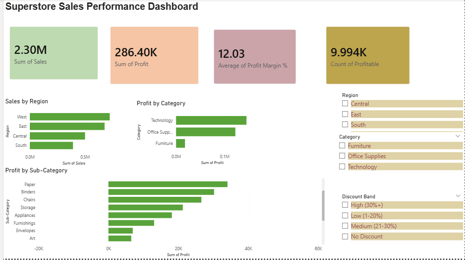

# Superstore Sales Performance Analytics
End-to-end Business Intelligence project analyzing sales performance, regional profitability, discount impact, and profit prediction using Machine Learning.

## 🔗 Project Links
- 📓 Notebook: `notebooks/01_data_exploration.ipynb`
- 📊 Power BI Dashboard: `superstore_dashboard.pbix`

## 📊 Key Business Findings
- Central region has the lowest profit margin (7.92%) despite $501K in sales
- Furniture category is nearly unprofitable — only 2.49% margin vs 17.4% for Technology
- Tables sub-category alone lost **$17,725** — the single biggest loss-maker
- Discounts above 30% consistently generate losses — confirmed by ML feature importance
- Discount is the #1 driver of profitability (60.4% feature importance)
- ML model predicts profitable transactions with **94% accuracy**

## 🧠 What This Project Covers
- Full exploratory data analysis with 8 business-driven visualizations
- Regional, Category, Sub-Category and Segment performance analysis
- Discount impact analysis with correlation and scatter visualization
- Region × Category profitability heatmap
- Profit Prediction ML model (Random Forest Classifier)
- Confusion Matrix and Feature Importance analysis
- Interactive Power BI dashboard with slicers and KPI cards

## 🧱 Tech Stack
Python, Pandas, NumPy, Scikit-learn, Matplotlib, Seaborn, Power BI

## 🤖 ML Model
| Model | Type | Purpose |
|---|---|---|
| Random Forest | Ensemble Classification | Profit/Loss Prediction |

## 📈 Model Performance
| Metric | Score |
|---|---|
| Accuracy | 94% |
| Precision (Profitable) | 95% |
| Recall (Profitable) | 98% |
| Precision (Loss) | 88% |
| Recall (Loss) | 76% |

## 🔍 Libraries & Tools
| Library | Purpose |
|---|---|
| Pandas | Data manipulation and analysis |
| NumPy | Numerical operations |
| Scikit-learn | ML model and evaluation |
| Matplotlib | Base visualizations |
| Seaborn | Statistical visualizations |
| Power BI | Interactive business dashboard |

## 📂 Project Structure
superstore-sales-analytics/
│
├── data/
│   ├── SampleSuperstore.csv          ← Raw dataset
│   └── superstore_powerbi.csv        ← Enriched dataset for Power BI
│
├── notebooks/
│   └── 01_data_exploration.ipynb     ← Full analysis notebook
│
├── visuals/
│   ├── 01_regional_analysis.png
│   ├── 02_category_analysis.png
│   ├── 03_subcategory_analysis.png
│   ├── 04_discount_analysis.png
│   ├── 05_segment_analysis.png
│   ├── 06_heatmap_region_category.png
│   ├── 07_confusion_matrix.png
│   └── 08_feature_importance.png
│
└── superstore_dashboard.pbix         ← Power BI Dashboard

## 📸 Dashboard Preview

## ⚠️ Dataset Note
Sample Superstore is a fictional retail dataset commonly used for business analytics practice. This project treats it as a B2B technology sales dataset to simulate real-world scenarios relevant to enterprise sales analytics.

## 👤 Author
Aniqua Nawar — Data Analyst / Data Science Portfolio Project